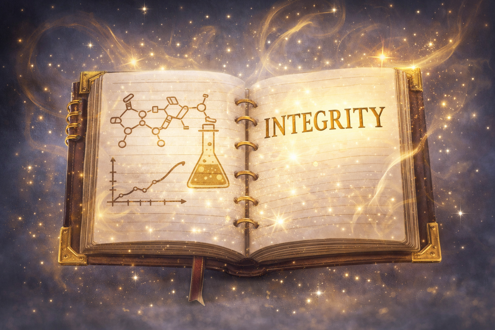
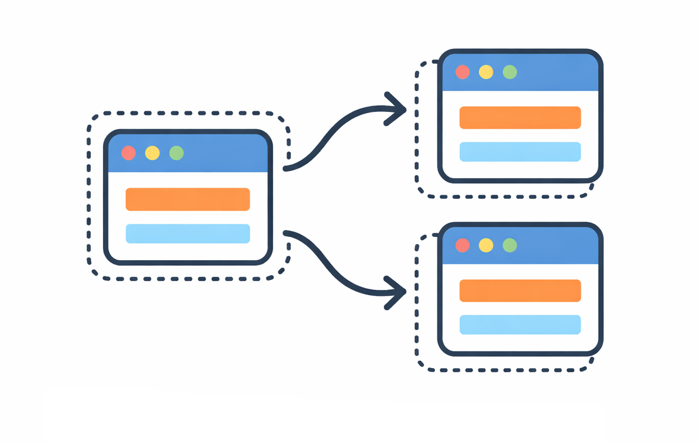
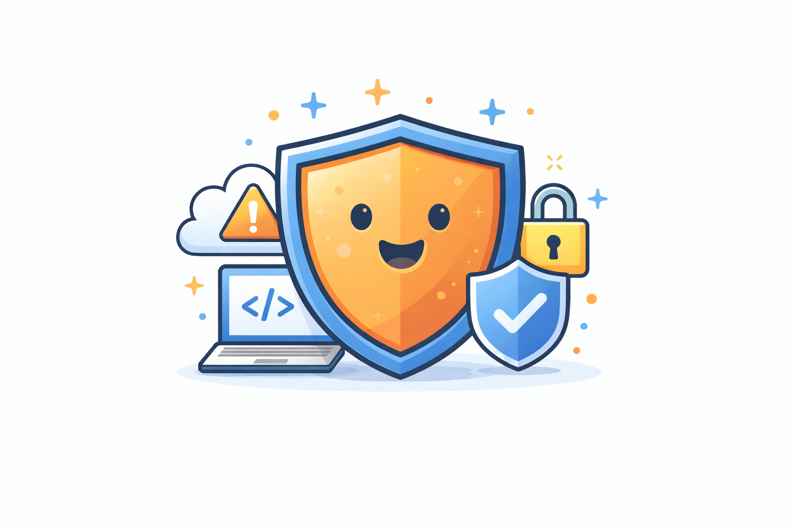
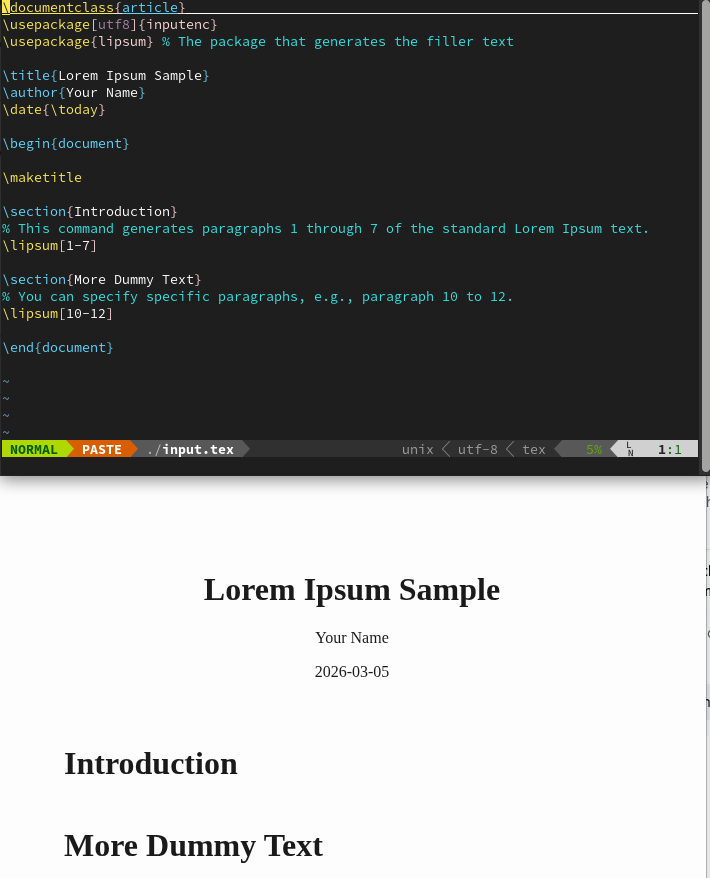
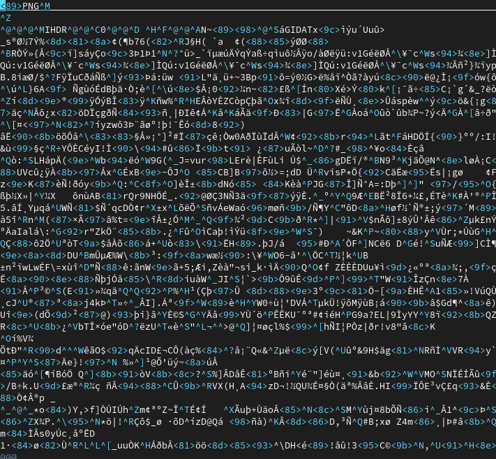
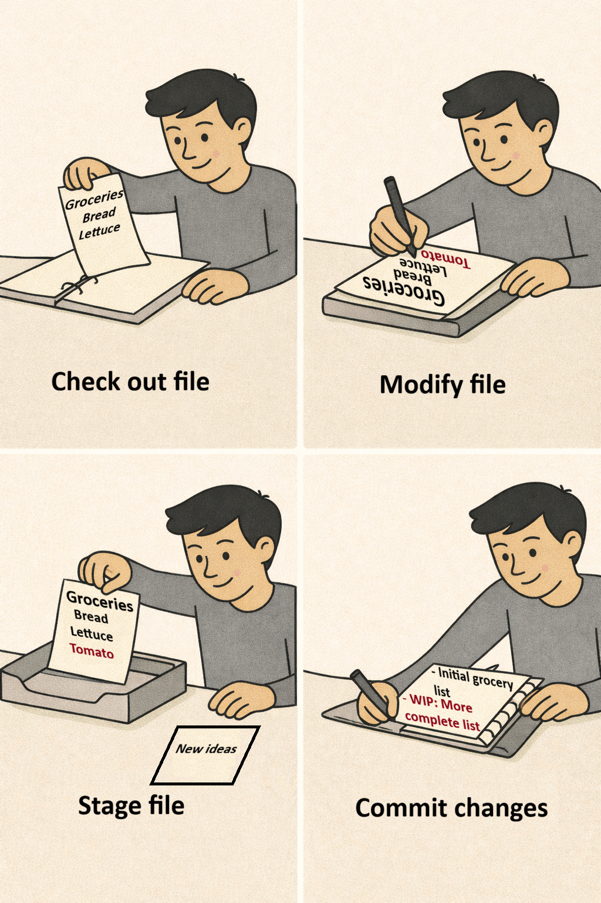
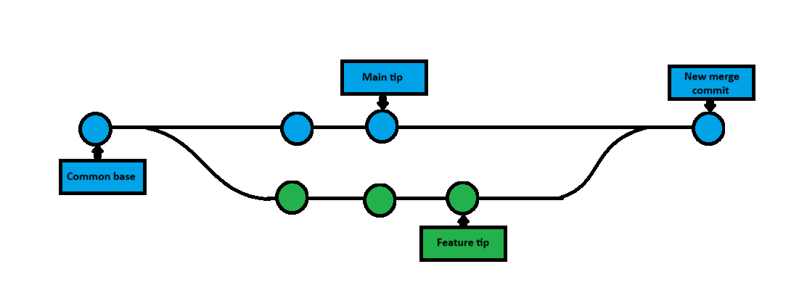
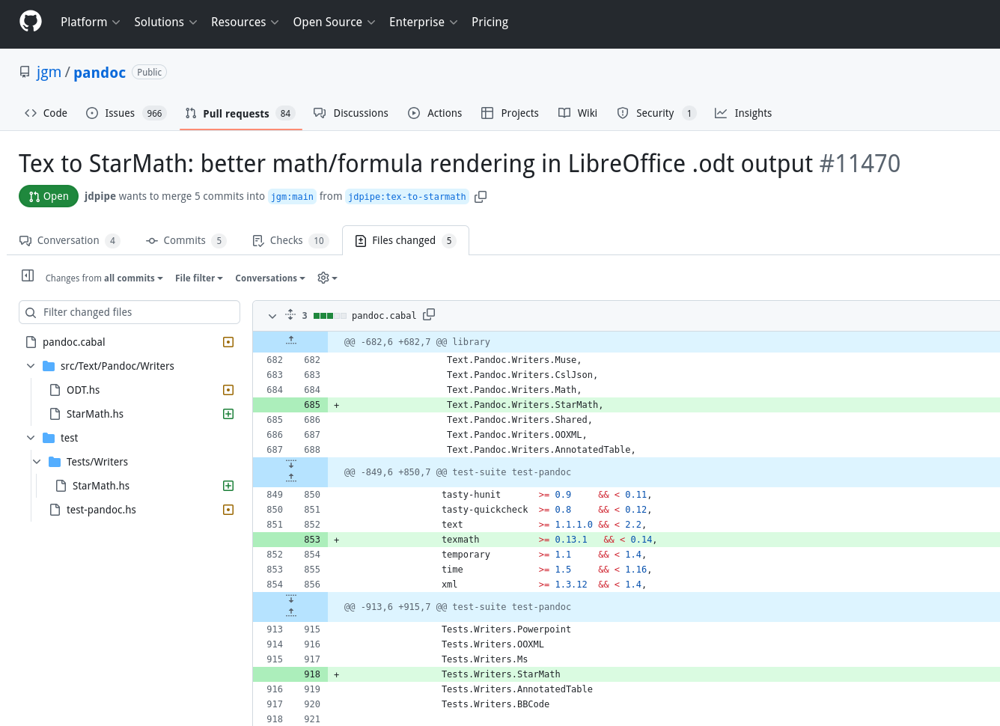

---                                                                             
title: "What do I Git out of it?"
subtitle: "Git started in under an hour \n An introduction to Git for Scientists and Engineers"
author: "Prabhu S. Khalsa"
date: today
---

<!-- slide 2 -->
# Why Git? {layout="Two Content"}
:::: columns
::: column

Imagine

- A laboratory notebook whose pages can come alive to
- Move forward and backward in time
- Precisely attribute its contents to their creators
- Tell you its own history
- Tell you a story of collaboration
- Invite you to contribute
- Invite you to experiment without negative consequences
- Duplicate itself just for you

See

- Why git is important
- Why you should use it
- How easily you can start
:::
::: column

:::
::::

<!-- slide 3 -->
# Git is powerful (and so can you!) {layout="Two Content"}
:::: columns
::: column

- Git = Reproducibility + Safety + Collaboration
  - Scientific and Engineering integrity require Reproducibility and Traceability

&nbsp;

- Safety and Collaboration
  - Experimentation through branching encourages innovation
  - Collaboration without Chaos – multiple people, but one clean history

&nbsp;

- Professional work
  - Debugging and Recovery – Find problems faster
  - Easy Scalability
:::
::: column

:::
::::

<!-- slide 4 -->
# Reproducibility, Safety, Collaboration {layout="Two Content"}
:::: columns
::: column

- &#128220; Complete history of every change
- &#128300; Reproducible results
- &#129514; Safe experimentation with branches
- &#129309; Parallel collaboration without overwrites
- &#128524; Recovery from mistakes 
- &#9989; Scientific and Engineering integrity require
  - Reproducibility and Traceability
  - Recreate exact results from any past version
  - Identify which code produced which figure
  - See who changed what and why
  - Maintain long-term project memory
- &#128683; Before git
  - Analysis_final_v7_for_real_20260305.py
- &#128077; With git
  - clear, time-stamped, documented revisions
:::
::: column

:::
::::

<!-- slide 5 -->
# Safety and Collaboration {layout="Two Content"}
:::: columns
::: column
- Experimentation through branching encourages innovation
  - Try new algorithms safely
  - Explore alternate models
  - Test parameter changes
  - Prototype without risk
  - If failure:
    - Switch back instantly with no damage to stable work
      - Removes fear of breaking things
- Collaborate without chaos – multiple people, but one clean history
  - Work in parallel
  - Merge changes intelligently
  - Detect and resolve conflicts cleanly
  - Avoid email attachments, shared drives, file name versioning, manual merge errors

:::
::: column

:::
::::

<!-- slide 6 -->
# Professional Work {layout="Two Content"}
:::: columns
::: column
- Debugging and recovery
  - Find problems faster
    - Small logical commits
    - Precise change tracking
    - Identify when a bug was introduced
  - Revert to known good states
  - Git makes debugging scientific
  - Never debug the same problem again!
- Easy scalability
  - Solo grad student &rarr; Multi-institution collaboration
  - Single script &rarr; Full simulation framework
  - Short experiment &rarr; Decades long program
- Git is industry standard
  - Essential to software engineering
  - Increasingly expected for broader scientific and engineering work

:::
::: column

:::
::::

<!-- slide 7 -->
# Git beyond code: Applications in Science & Engineering {layout="Two Content"}
:::: columns
::: column

&nbsp;

- Data analysis workflows
  - Track changes in Python/R/Matlab notebooks

&nbsp;

- Documents (html/markdown/LaTeX/etc.) + version control
  - Reports, grant proposals, lab manuals, manuscripts

&nbsp;

- CAD/Engineering design
  - Collaborate on configuration files or parametric scripts

&nbsp;

- Simulations
  - Keep track of model versions, parameters, and results
:::
::: column

:::
::::

<!-- slide 8 -->
# What NOT to put in git {layout="Two Content"}
:::: columns
::: column
- Large binary files
  - Git's Strength is in line-based diffs
  - Git uses a line-by-line comparison system to track changes between file versions. This works great for:
    - Code (.py, .c, .tex, .md, etc.)
    - Configuration files (.yaml, .json)
    - Documentation in plain text formats\
  - Binary files, however, are stored as sequences of bytes that do not have clear line breaks. Git:
    - Cannot show meaningful differences when you run git diff
    - Treats each version of a binary file as entirely new, even for small changes

&nbsp;

- Use .gitignore to ignore common binary file extensions (e.g. *.png)
:::
::: column

:::
::::
::: notes
Small binary files are fine, they will simply be replaced when they are changed
:::

<!-- slide 9 -->
# So what is git? {layout="Two Content"}
:::: columns
::: column
It's not just a software development tool, it is a ...
:::
::: column

:::
::::

<!-- slide 10 -->
# Key Git Concepts {layout="Two Content"}
:::: columns
::: column

- Repository (repo): a tracked project folder\
- Commit: a snapshot of changes\
- Branch: a parallel line of development

:::
::: column

{width=100%}
:::
::::

::: notes
The binder is a repository, the paper is a file, the box is the staging area
the notebook is the git log with a new entry after the paper has been added
back into the binder
:::

<!-- slide 11 -->
# Essential Git Commands {layout="Title and Content"}
| Action          | Command                   | Description                         |
|:----------------|:--------------------------|:------------------------------------|
| Initialize repo | *git init*                | Start tracking current directory    |
| Clone a repo    | *git clone \<URL\>*       | Clone an existing repo              |
| Check status    | *git status*              | See current state of repo           |
| Add files       | *git add \<file\>*        | Stage changes for commit            |
| Commit changes  | *git commit -m "Message"* | Save a snapshot with a message      |
| View history    | *git log*                 | See previous commits                |
| Create a branch | *git branch \<name\>*     | Make a new branch                   |
| Switch branches | *git checkout \<name\>*   | Move to another branch              |
| Merge branches  | *git merge \<name\>*      | Merge other branch into current one |
| Push to remote  | *git push*                | Upload changes to GitHub/GitLab     |
| Pull updates    | *git pull*                | Download updates from remote repo   |

<!-- slide 12 -->
# Typical workflow in collaborative project {layout="Content with Caption"}

- Clone Repository - brings the repository into your working directory
- Create Branch - space to do your work before merging back into the main branch
- Add and Commit changes - staging and committing your work with meaningful messages about changes
- (optionally) rebase or merge - incorporate changes/updates of parent branch into your branch
- Push - push your local branch to one of your remotes to backup your branch
- Merge - When development has completed, after review, merge your branch into the main upstream development branch

<!-- slide 13 -->
# Beyond the command line {layout="Two Content"}
:::: columns
::: column

- Online platforms like GitHub/GitLab allow
  - Cloud (or server) backups
  - Visualizing differences between versions
  - Managing issues and project tasks
  - Collaborating asynchronously
  - CI/CD - continuous integration/continuous deployment

:::
::: column
{width=100%}
:::
::::

<!-- slide 14 -->
# Tips for adopting Git in scientific work {layout="Two Content"}
:::: columns
::: column

- Start simple
  - Track a small project like a paper or data analysis script
- Use visual tools
  - GitHub Desktop, GitKraken, or VSCode Git UI
- Commit regularly
  - Small frequent commits tell a better story than rare massive ones
- Write meaningful commit messages
  - “Fixed bug in data cleaner” is more useful than “stuff”
  - If applied, this commit will...
- Backup to remote
  - Use GitHub or GitLab to avoid local data loss
- Check out software carpentry’s git lessons

:::
::: column

:::
::::
::: notes
https://swcarpentry.github.io/git-novice/  
:::

<!-- slide 15 -->
# Conclusion {layout="Two Content"}
:::: columns
::: column

- Git is a lightweight, powerful “Scientific Integrity” tool
  - Reproducibility + Safety + Collaboration
    - Complete history of every change
    - Collaboration without chaos
    - Allows for experimentation
    - Grows with your project
  - Professional work that's easy to scale and to recover

&nbsp;

- Whether you're writing code, papers, or setting up experimental workflows, Git will make your work more robust and future-proof

:::
::: column

:::
::::

