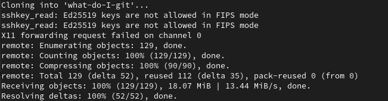
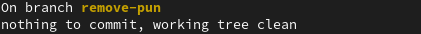
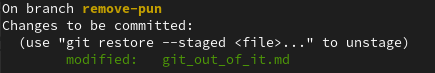
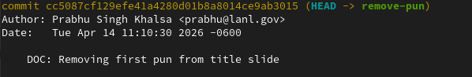

---                                                                             
title: "Let me Git to it"
subtitle: "Practicum"
date: today
---

<!-- slide 2 -->
# Let's clone a repo
:::: columns
::: column
\
\
$ git clone https://github.com/Prabhu-LANL/what-do-I-git.git
$ cd what-do-I-git
$ git status
:::
::: column

:::
::::
::: notes
Using ssh
$ git clone git@github.com:Prabhu-LANL/what-do-I-git.git
:::

<!-- slide 3 -->
# Create a branch
:::: columns
::: column
\
\
$ git branch remove-pun
$ git checkout remove-pun
$ git status
:::
::: column

:::
::::

<!-- slide 4 -->
# Make some changes and stage them for the next commit
:::: columns
::: column
\
\
$ sed -i 's/Git out of it/get out of Git/g' git_out_of_it.md
$ git status
$ git add git_out_of_it
$ git status
:::
::: column

:::
::::

<!-- slide 5 -->
# Make a commit
:::: columns
::: column
\
\
$ git commit -m "DOC: Removing first pun from title slide"
$ git log
:::
::: column

:::
::::

