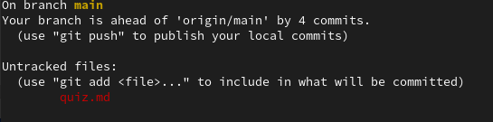

---                                                                             
title: "What did I Git out of it?"
subtitle: "Quiz"
date: today
---

<!-- slide 2 -->
# What git command might I type between all other git commands?
:::: columns
::: column
\
\
Hint: It will report on the current state of the repo
:::
::: column

:::
::::
::: notes
Answer: git status
:::

<!-- slide 3 -->
# What git command will start tracking a file or stage changes before a commit?
:::: columns
::: column
\
\
Hint: You've got a stack of papers in your repository and somebody brings you another.
"___ it to the pile"
:::
::: column

:::
::::
::: notes
Answer: git add
:::

