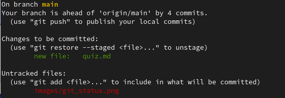
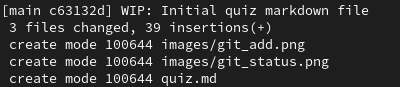
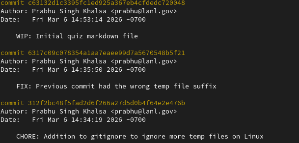

---                                                                             
title: "What did I Git out of it?"
subtitle: "Quiz"
date: today
---

<!-- slide 2 -->
# What git command might I type between all other git commands?
:::: columns
::: column
\
\
Hint: It will report on the current state of the repo
"Can you give us a quick _____ update?"
:::
::: column

:::
::::
::: notes
Answer: git status
:::

<!-- slide 3 -->
# What git command will start tracking a file or stage changes before a commit?
:::: columns
::: column
\
\
Hint: You've got a stack of papers on your desk and somebody brings you another
"Just _____ it to the pile"
:::
::: column

:::
::::
::: notes
Answer: git add
:::

<!-- slide 4 -->
# What git command saves a snapshot of the changes and is paired with a message for the log?
:::: columns
::: column
\
\
Hint: One of the reasons to use git is to have a log that allows you to not
“_____ everything to memory”
:::
::: column

:::
::::
::: notes
Answer: git commit -m "If committed this change will..."
:::

<!-- slide 5 -->
# What git command shows us the history of the repository?
:::: columns
::: column
\
\
Hint: Your mileage may vary, but you’ll go farther if you remember to
“_____ an entry into the _____book”
:::
::: column

:::
::::
::: notes
Answer: git log
:::

